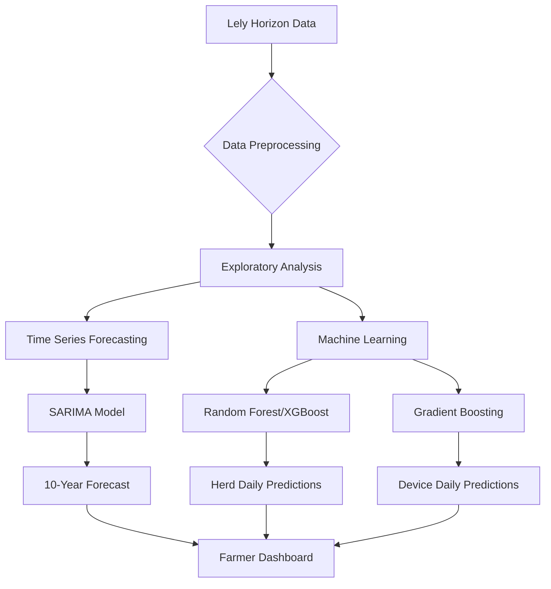

# Big Data Analytics for Dairy Production Optimization

**Master of Data Science Capstone Project**
*University of Melbourne | October 2024*

[](https://github.com/SX0818/DS_project) 
[](#) [](#)
---

## Project Overview 🐄

This project leverages big data analytics and machine learning to optimize milk production in modern dairy farms. By analyzing operational data from **Lely Horizon** farm management systems, we developed predictive models to address key challenges:

- **Forecast milk production** (2025-2035) with seasonal adjustments
- **Optimize feed consumption** using polynomial regression thresholds
- **Predict milk yield** via ensemble machine learning models
- **Identify operational bottlenecks** through IoT sensor analytics

**Key Outcomes**:

📈 95% accuracy in herd-level milk yield prediction (R²=0.95)

🌾 12.7% potential feed cost reduction via optimized thresholds

🔄 Identified 300s as optimal milking duration (diminishing returns beyond)

---

## Technical Architecture ⚙️



---

## Key Features ✨

1. Time Series Forecasting

- **SARIMA(1,1,2)(1,1,1,12)** model with 365-day seasonal decomposition
- ADF test (p=3.7e-5) confirmed stationarity
- 10-year forecast with widening confidence intervals

2. Feed-Yield Optimization

- Quadratic regression: **Threshold = 4,332.87 kg**
  y = -0.000259x^2 + 2.2458x + 982.99
- Cubic regression dual thresholds: **557.66 kg** and **1,793.31 kg**

3. Machine Learning Models

| Dataset                | Best Model        | MSE   | R²  | Key Features                           |
| ---------------------- | ----------------- | ----- | ---- | -------------------------------------- |
| **Herd Daily**   | Random Forest     | 0.89  | 0.95 | Feed, Lactation Days, Rumination       |
| **Device Daily** | Gradient Boosting | 5,207 | 0.91 | Milking Speed, Duration, Robot Metrics |

4. Hyperparameter Optimization

- GridSearchCV with **162 parameter combinations**
- Tuned `n_estimators`, ` max_depth`, `learning_rate`
- 3-fold cross-validation to evaluate model performance

---

## Repository Structure 📂

To set up the repository structure, you can run the `setup_structure.sh` script using the following command:

```bash
bash setup_structure.sh
```

## Installation & Usage 💻

### Requirements

- Python 3.8+
- Jupyter Notebook

### Quick Start

```bash
# Clone repository
git clone https://github.com/SX0818/DS_project
cd DS_project

# Install dependencies
pip install -r requirements.txt

# Launch Jupyter Lab
jupyter lab
```
